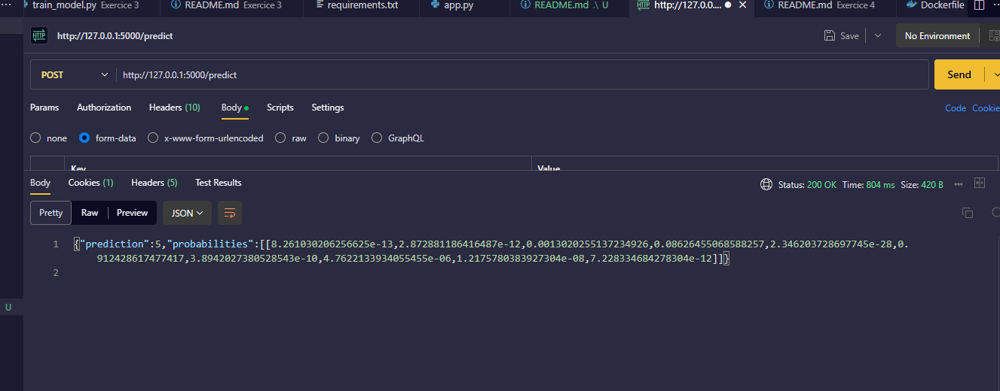

# TP: De la conception au déploiement de modèles de Deep Learning
Le projet regroupe plusieurs exercices pratiques autour du développement, du suivi et du déploiement de modèles de Deep Learning.

## Démo API Flask


## Structure du projet
- [./Exercice 1](./Exercice%201/): Construction et entraînement d’un réseau de neurones avec Keras sur MNIST.
- [./Exercice 3](./Exercice%203/) : Suivi des expérimentations avec MLflow (paramètres, métriques, modèle).
- [./Exercice 4](./Exercice%204/) : Déploiement du modèle via une API Flask et conteneurisation avec Docker.

- [requirements.txt](./requirements.txt) : Dépendances utilisées pour chaque projet.

## Prise en main
1. Cloner, Créer et Activer un env virtuel
```sh
git clone https://github.com/nullhq/tp-deeplearning.git
cd tp-deeplearning
python -m venv venv # pour créer l'env virtuel
source venv/Scripts/activate  # ou `source venv/bin/activate` sur Linux/Mac
```

2. Intaller les dépendances
```sh
pip install -r requirements.txt
```

3. Lancer l'API Flask
```sh
cd Exercice\ 4
python app.py
# L'app est maintenant disponible sur : http://127.0.0.1:5000/predict
```

## Contacts
- Encadreur : Mr TINKU Claude (tinkuclaude@gmail.com)
- Etudiant : TABOUTSA Fredy (taboutsafredy@gmail.com)